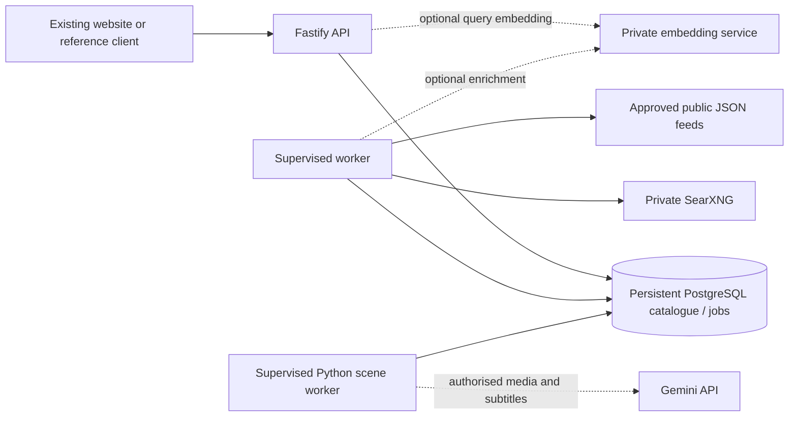

# Deployment and operations

## Topology

Use `npm run start` for the API and `npm run worker` for a **separate supervised process**, both from the repository root. `Dockerfile` builds the Node service and can run either command. The optional scene worker is a third supervised process: Python 3.11+, installed with `pip install -e scene-worker` (add the `transcribe` extra for faster-whisper), started with `python -m zenatlas_scenes work` from the repository root. It needs the runtime `DATABASE_URL`, `GEMINI_API_KEY`, and read access to `SCENE_MEDIA_ROOT`; `Dockerfile` does not include it. Keep the Gemini key server-side and send media only from sources whose reviewed policy permits `video_analysis`. A static host cannot execute this engine. Short-lived/serverless web routes need continuously running worker/SearXNG compute elsewhere. No deployment credentials or existing hosting were supplied.

Local Compose only publishes database/SearXNG ports on loopback. In production use a private service network, TLS/authenticated internal service calls where appropriate, and a reverse proxy exposing only the API/static reference client. A container cannot reach the host's services through its own `localhost`; use actual service DNS names (for example `db` or `searxng`) in its environment. Do not give internal addresses or credentials to the browser. Set `PUBLIC_ORIGIN` to the actual website origin.

The service does not trust forwarded IP headers. If a reverse proxy is present, configure Fastify's `trustProxy` for only your exact trusted proxy addresses before scaling public usage; otherwise all users behind the proxy share its IP quota. Never blindly trust arbitrary `X-Forwarded-For`. Set the proxy's own connection/request limits. Restrict health/admin access according to deployment needs. No open CORS policy is required for same-origin integration.

## Dependencies and images

`package-lock.json` fixes installed dependency versions. Run `npm ci` and `npm run build` before creating an artifact. Node 24.20.0 was available locally. `Dockerfile` selects `node:24.20.0-bookworm-slim`; the local database config selects `pgvector/pgvector:0.8.6-pg18-bookworm`. Image availability/build/runtime were not verified because Docker's engine was stopped. Pin the resolved digests and scan your artifact as part of deployment.

The SearXNG overlay has no invented default version. Resolve an actual official image digest, record its matching source revision and license notices, then set `SEARXNG_IMAGE`. Enable JSON output and confirm your selected engine works. A JSON 403 can mean JSON format is disabled; CAPTCHA, throttling or upstream blocking must be reported/handled, not bypassed. The provided limiter-off SearXNG settings require its loopback/private-only placement; do not expose that instance directly to the public.

## Database migration and credentials

1. Create persistent PostgreSQL storage and an owner connection; keep backups outside application containers.
2. Set `MIGRATION_DATABASE_URL`, run `npm run migrate`. Migrations acquire a PostgreSQL advisory transaction lock and record applied filenames in `schema_migrations`. DDL is transactional. Never edit a migration after deploying it; add a new version.
3. Run `npm run db:app-user` with the separate `APP_DATABASE_PASSWORD`. Configure matching `DATABASE_URL` for the `search_app` runtime login. It can access application data and migration status but cannot create schemas/tables or act as a superuser. Do not run normal API requests as the owner.
4. Optionally apply `npm run migrate -- --vectors`, then rerun the privilege script. The vector table is optional; lexical search has no extension dependency.
5. Load the real starter links with `npm run seed` or import your approved metadata. No test fixtures should be imported.
6. Start API and worker; perform the checks below before routing public traffic.

The application mediates ownership for search snapshots and feedback using a signed session ID. Database roles are service-level roles, not tenant roles; there is no browser-direct database access or platform account integration. Integrate trusted authenticated identity before introducing account-private saved media. Administrator tokens are separate from browser sessions.

## Retention, budgets and supervision

Use the defaults in `.env.example` as initial small limits. Both query and content embeddings consume the daily embedding budget; retries/failed provider work can still consume budget. External adapter requests may have paid terms or compute costs even though this project provisions nothing paid. No production cost/latency estimate has been measured.

Supervise `worker-main.ts` with your container orchestrator/service manager. The loop polls persisted schedules; no browser timer drives indexing. On graceful stop the current bounded job finishes. A crash leaves a 90-second lease; another worker reclaims it. Job transitions use lease tokens to prevent stale completion, and metadata ingestion is idempotent. Three failed attempts terminate a job. A stalled or failed source backs off and can be paused automatically. Inspect `GET /api/admin/health` and structured events `worker_cycle_failed`, `request_failed`, and `database_pool_error` without logging raw requests/credentials.

Public fetches resolve all addresses, reject private/non-unicast networks, pin one validated IP to the connection, and validate each redirect anew. Requests reject unsafe schemes, URL credentials, nonstandard public ports, oversized bodies, unsupported content types and unexpected content encoding. Fixed private service endpoints are controlled by server configuration and reject redirects, keeping private credentials on the configured origin. Feed owners must explicitly approve collection; the collector does not scrape arbitrary web pages, bypass robots directives, CAPTCHAs, or access controls. If introducing a crawler, robots/terms handling must be implemented first.

## Readiness checklist for your deployment

1. `GET /health/live` and `/health/ready` return 200.
2. Catalogue-only search for a seeded title returns the stored URL without any external/model credentials.
3. Use your SearXNG instance directly from server compute: `/search?q=Blender&format=json&engines=youtube&categories=videos`. Confirm JSON and upstream status, then check the API's sparse/refresh search and polling.
4. Repeat a discovery query and confirm one content record per canonical/provider identity and one active job per normalized query/filter key. Check the later catalogue-only result.
5. Make SearXNG unavailable and verify local results plus a partial notice. Confirm no raw service URL or error leaks.
6. Run two real PostgreSQL workers, terminate one during a job, and check lease recovery/no duplicate records. Embedded tests cover transitions, but do not establish multi-process database behaviour in your deployment.
7. Try another session's search ID, ordinary access to admin routes, and invalid cursors. All must be denied.
8. Verify your authenticated identity mapping, HTTPS cookie behaviour, proxy IP configuration, quotas, actual source permissions and retention/cleanup.
9. Optional vector integration: migrate, configure a compatible endpoint, enqueue content enrichment, verify the stored model/dimension and hybrid query, then stop the endpoint and confirm lexical fallback.
10. Import only permitted real transcripts; review text, timings, duration and narrative context before treating timestamps as useful footage suggestions. 
11. Scene worker: approve `video_analysis` for one reviewed source, register an accessible version, run `work --once`, and confirm that `status` shows `complete` and `/api/search` returns its scenes at the expected offset. Then make the media unavailable (for example, rename the file), queue it again, and confirm an explicit `inaccessible` status with no new scenes. Have a person compare a sample of scene timestamps with the video before treating them as reliable.

## Backups and rollback

Back up through PostgreSQL-aware tools, for example `pg_dump --format=custom --file=creator-search.dump` with a secured owner connection supplied through your environment/service secret. Do not stream binary backups through Windows PowerShell text redirection. Test restoring that dump to an isolated database before relying on it. Align backup retention with your content/user-data deletion policy.

For a code/ranking rollback, stop routing new traffic, stop the worker, deploy the previous artifact, set `SEMANTIC_ENABLED=false` if disabling the optional provider, and invalidate active `searches` snapshots using an administrative database session. Resume traffic after health and catalogue checks. Keep `ranking_version` consistent with the deployed implementation. Base migrations are additive; do not drop catalogue tables to roll back application code.

For a bad data/schema migration, restore the last verified backup to a **new** database and verify before switching connection secrets. Never restore over an existing production database without a reviewed recovery plan. No automated destructive down migration is included. Source-specific removals should use the policy/content deletion controls so cached metadata and evidence are removed as well.
