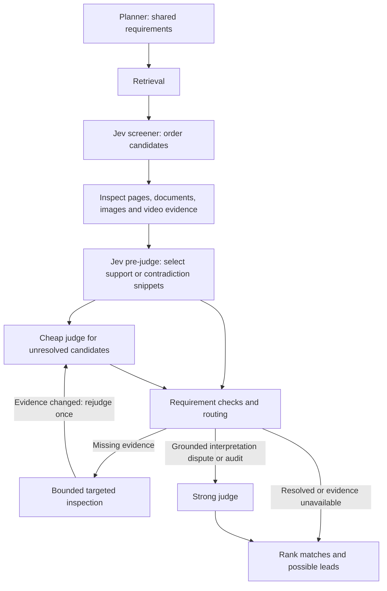

# Evidence-directed cascade

Implemented after the [architecture review](cascade-architecture-review-2026-09-27.md). The configured scorer and strong models stay in place; routing and evidence handling change.

The inspection edge is a single pass, not an iterative loop. After it, a still missing requirement stays uncertain and does not trigger another model opinion on the same absent evidence.

## Contracts and evidence

- Web, Docs, Images and video discovery carry numbered requirements through screening and judging. Web/Docs/Images use a primary contract planner with provider fallbacks and a bounded, date-aware cache. Existing video discovery planning remains in place.
- Contract requirements retain source-query spans when available. New contract planner output must cite an actual query span; rule fallback preserves late clauses and separates visual appearance from rights and non-AI provenance. Set coverage remains distinct from per-result requirements.
- Jev selects a supplied snippet for support or contradiction. A categorical mismatch, low relevance, low reliability score or high confidence alone cannot reject a candidate.
- Snippet selection balances page text, transcripts, scenes, comments and deterministic facts, with requirement terms prioritizing relevant passages.
- Visual observations reference the SHA-256 of the actual supplied image bytes. A stale reference without those bytes is unknown. Source provenance must come from textual provenance or inspected page content, not appearance.
- Deterministic inspection facts govern format, dates, duration, authority and completeness where available. Titles and search snippets do not establish content requirements.

Grounding establishes that the cited evidence exists and is of an eligible kind. It does not independently prove that the model interpreted it correctly. Interpretation still requires evaluation and audits.

## Routing and presentation

Missing evidence first gets bounded collection: unread Web/Docs content, a video's available captions, original image pixels, or an image's source page for provenance. The cheap judge is called again only when the candidate's evidence fingerprint changes. Scene inspection continues through the existing video inspection jobs.

A cheap judge can request stronger reasoning with `next_action: reason`, but must anchor that request in eligible supplied evidence. Strong receives the unresolved requirement IDs and flags without the prior numeric score. Existing borderline and conflict checks remain, with audits of grounded Jev settlements and rejections.

Unknown hard requirements remain possible matches at score 5. An unchecked exclusion is named as a gap rather than waived as satisfied. Web/Docs/Images expose uncertainty metadata; Web and Images display possible-match labels, and Docs uses the shared lead/uncertainty presentation. Video discovery preserves its existing closest-match path.

Web/Docs group identical normalized inspected text and retain alternate URLs. Canonical-source preference and verified-first ordering are deterministic. This is exact evidence deduplication, not semantic work/edition recognition; matching titles alone never merge.

## Controls and tracing

`JUDGE_ARCHITECTURE=cascade` keeps the existing architecture selection. The production cascade integrations use the configured Strong seat; explicitly disabling that seat in an injected review configuration retains the single-judge path. Deterministic checks inside the real model judge still apply.

| Setting | Default | Meaning |
| --- | --- | --- |
| `CASCADE_INSPECTION_LIMIT` | 3 | Maximum candidates recollected in one cascade invocation |
| `CASCADE_INSPECTION_MS` | 8000 | Collection deadline per candidate; judge calls retain their model timeouts |
| `CASCADE_BORDER_LOW/HIGH` | Existing configured band | Borderline scores considered for Strong when evidence is available |
| `JEV_SETTLED_AUDIT_RATE` | Existing configured rate | Samples both grounded accepts and rejects |

Set the inspection limit to zero to disable additional collection. Timed-out collectors cannot replace the candidate evidence after the deadline; underlying fetch helpers retain their own network timeouts.

Searches carry a trace ID across asynchronous review work. Cascade logs include `version: evidence-v2`, flags, missing requirement IDs, evidence hashes, collection counts and the strong model that answered. OpenRouter model logs and Jev screener/pre-judge usage carry the trace ID. Missing reported prices remain null. These logs are not a complete bill for search providers, scene workers or every ancillary decision role.

The architecture benchmark now calls the production `cascadeReview`, records its source hash and settings, and uses deterministic audit sampling. Its frozen-evidence runs disable external collection. They measure the routing/judging portion, not end-to-end retrieval gains.

## Validation boundaries

Regression coverage includes forged contradiction quotes, visual references with and without pixels, non-AI provenance, changed/unchanged evidence, collection limits and timeout, interpretation routing, rejection audits, set coverage and exact-copy grouping. Legacy score-only scheduling fixtures explicitly disable contracts; contract integration has separate pipeline and routing tests.

No new live model-quality or cost comparison is claimed by this implementation. The historical benchmark numbers in the earlier review describe the earlier architecture. A new held-out, human-reviewed multimodal evaluation is needed before claiming improved precision, recall, latency or spend.

Local verification completed on September 28, 2026 (Asia/Calcutta):

- `npm test`: 363 passed, 0 failed, 1 skipped (364 total).
- `npm run build`: passed.
- `node --check public/results.js`: passed.
- `git diff --check`: passed.

Full test output: `output/cascade-v2-tests-final.log`. No deployment or live benchmark was performed.
